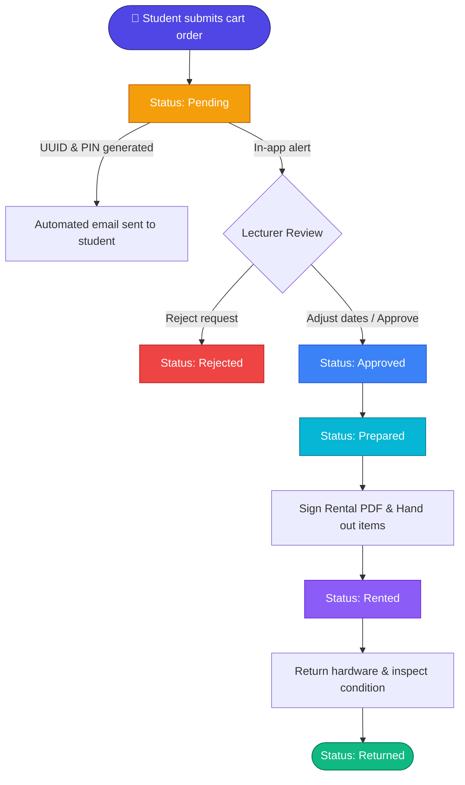

# 🔬 IoT Lab — Laboratory Inventory & Reservation System

[](https://react.dev/)
[](https://vitejs.dev/)
[](https://tailwindcss.com/)
[](https://nodejs.org/)
[](https://expressjs.com/)
[](https://www.mongodb.com/)
[](https://put.poznan.pl/)

> 🎓 **Laboratory inventory and equipment reservation system (Engineering Thesis at Poznań University of Technology).**

---

## 📑 Table of Contents

- [Overview](#overview)
- [Key Features](#key-features)
- [Role-Based Access Control](#role-based-access-control)
- [Order Lifecycle](#order-lifecycle)
- [Tech Stack](#tech-stack)
- [Project Structure](#project-structure)
- [Getting Started](#getting-started)
  - [Prerequisites](#prerequisites)
  - [1. Clone Repository](#1-clone-repository)
  - [2. Environment Configuration](#2-environment-configuration)
  - [3. Backend Setup](#3-backend-setup)
  - [4. Frontend Setup](#4-frontend-setup)
  - [5. Database Seeding & Initialization](#5-database-seeding--initialization)
- [Test Credentials](#test-credentials)
- [Application Routes](#application-routes)
- [NPM Scripts Reference](#npm-scripts-reference)
- [License](#license)

---

## 📖 Overview

Laboratory inventory and equipment reservation system developed as an Engineering Thesis at Poznań University of Technology (PP). Enables students to request IoT hardware without registration, while providing staff with inventory tracking, timeline scheduling, and automated PDF rental agreements.

---

## ✨ Key Features

### 📦 Dynamic Inventory & Hardware Catalog
- **Custom Extra Fields**: Dynamic schema support per category/item (e.g., voltage, pinout, interfaces, package type).
- **Hierarchical Categories & Tags**: Nested categories with intuitive drag-and-drop (`@dnd-kit`) reordering.
- **Components & Bundles**: Group minor electronic parts into lab bench kits.
- **Live Search & Multi-filter**: Real-time filtering by item name, room, lecturer, tags, and stock availability.
- **PDF Inventory Reports**: One-click generation of printable equipment inventory audits.

### 🛒 Seamless Guest Checkout & Tracking
- **No Mandatory Account**: Students and guests can submit rental requests directly via a 2-step cart checkout.
- **Bot Protection**: Integration with Google reCAPTCHA v2 / SVG captcha.
- **Private Order Tracker**: Each order receives a unique UUID and a secret access code sent via email.
- **Student Date Negotiation**: Students can review, approve, or reject modified pickup/return dates suggested by the lecturer.

### 📅 Order Management & Interactive Calendar
- **Interactive Timeline Calendar**: Built with `React Big Calendar` for visualizing reservations across different rooms and date ranges.
- **Safe State Transitions**: Confirmation dialogs on critical operations (approve, prepare, rent, return, reject).
- **Rental Agreement PDF**: Automatically generates signed rental contracts complete with student details, asset serials, terms of use, and signature blocks.
- **Real-Time Stock Forecasting**: Prevents double-booking by calculating overlapping reservation windows.

### 🔔 Notifications & Communication
- **In-App Notification Hub**: Real-time alerts for lecturers when items in their assigned rooms are requested.
- **Automated Email Dispatch**: Powered by `Nodemailer` with customizable HTML templates for new orders, status changes, and password resets.
- **Template Management**: In-app WYSIWYG editor for email templates with dynamic placeholder injection (`${CustomerName}`, `${UUID}`).

### 🎨 User Experience (UX/UI)
- **Dark & Light Mode**: Native theme switching styled with TailwindCSS v4.
- **Internationalization (i18n)**: Instant language switching between English (EN) and Polish (PL).
- **Public Announcement Board**: Admins can post notices and lab news directly on the home page.

---

## 👥 Role-Based Access Control

| Permission / Action | Guest / Student | Lecturer (Owner) | Administrator |
|:---|:---:|:---:|:---:|
| Browse public equipment catalog | ✅ | ✅ | ✅ |
| Submit rental requests via cart | ✅ | ✅ | ✅ |
| Track orders via UUID & PIN code | ✅ | ✅ | ✅ |
| Manage assigned room items & equipment | ❌ | ✅ | ✅ |
| Receive in-app reservation notifications | ❌ | ✅ | ✅ |
| Approve / Prepare / Rent / Return orders | ❌ | ✅ | ✅ |
| Generate Rental Agreement PDFs | ❌ | ✅ | ✅ |
| View reservation calendar | ❌ | ✅ | ✅ |
| Manage user accounts & permissions | ❌ | ❌ | ✅ |
| Edit dynamic categories & email templates | ❌ | ❌ | ✅ |
| Publish announcements on home page | ❌ | ❌ | ✅ |

---

## 🔄 Order Lifecycle



| Status | Actor | Description |
|:---|:---|:---|
| **Pending** | Student / System | Reservation placed via cart; automated email sent with order UUID and secret PIN. |
| **Approved** | Lecturer | Supervisor reviews equipment availability and accepts or adjusts dates. |
| **Prepared** | Lecturer / Lab Staff | Hardware items are verified, gathered, and marked ready for pickup. |
| **Rented** | Student & Lecturer | Rental Agreement PDF is signed and equipment is officially checked out. |
| **Returned** | Lecturer | Hardware is inspected, returned to inventory, and stock counts restore automatically. |
| **Rejected** | Lecturer | Request declined if components are unavailable or conflicting with lab schedules. |

---

## 💻 Tech Stack

### Frontend
- **Framework:** [React 19](https://react.dev/) + [Vite 6](https://vitejs.dev/)
- **Styling:** [TailwindCSS v4](https://tailwindcss.com/) + CSS Variables
- **UI Components & Icons:** [Material UI (MUI)](https://mui.com/), [Lucide React](https://lucide.dev/), [React Icons](https://react-icons.github.io/react-icons/)
- **Routing:** [React Router v7](https://reactrouter.com/)
- **Calendar:** [React Big Calendar](https://jquense.github.io/react-big-calendar/) + [Date-fns](https://date-fns.org/)
- **Drag & Drop:** `@dnd-kit/core`, `@dnd-kit/sortable`
- **PDF Generation:** [jsPDF](https://github.com/parallax/jsPDF) + `jspdf-autotable`
- **Charts:** [Recharts](https://recharts.org/)

### Backend
- **Runtime:** [Node.js](https://nodejs.org/) (ES Modules)
- **API Framework:** [Express 5](https://expressjs.com/)
- **Database:** [MongoDB](https://www.mongodb.com/) with [Mongoose 8](https://mongoosejs.com/) ODM
- **Authentication:** JSON Web Tokens (`jsonwebtoken`) + `bcrypt`
- **Email Delivery:** [Nodemailer](https://nodemailer.com/) (Gmail SMTP / Custom SMTP)
- **File Uploads:** `multer`
- **Scheduled Tasks:** `node-cron`
- **Security & Utilities:** `morgan`, `cors`, `svg-captcha`

---

## 📁 Project Structure

```plaintext
IoTLab/
├── backend/                  # Server-side application (Node.js & Express)
│   ├── config/               # Database connection (MongoDB)
│   ├── controllers/          # Business logic (Order, Product, User, Category, etc.)
│   ├── middleware/           # JWT auth, role validation, file upload middleware
│   ├── models/               # Mongoose schemas (User, Product, Order, Template, etc.)
│   ├── routes/               # REST API route endpoints
│   ├── services/             # Helper services (email dispatcher)
│   ├── utils/                # Mock data generators & utility functions
│   ├── uploads/              # Uploaded hardware images & assets
│   ├── init.js               # Clean production database initialization script
│   ├── seed.js               # Development mock data seeding script
│   └── server.js             # Main Express server entry point
│
├── frontend/                 # Client-side application (React + Vite)
│   ├── src/
│   │   ├── components/       # Reusable UI components (Orders, Products, Cart, Auth)
│   │   ├── context/          # React Contexts (Language, Theme, Auth, Toast)
│   │   ├── pages/            # Application views (Dashboard, Orders, Catalog, etc.)
│   │   ├── utils/            # PDF generators, i18n dictionaries, route guards
│   │   ├── App.jsx           # Master routing setup
│   │   └── main.jsx          # React DOM entry point
│   ├── public/               # Static web assets
│   └── package.json          # Frontend dependencies
│
├── .env                      # Environment variables (git-ignored)
├── package.json              # Backend scripts & root dependencies
└── README.md                 # Project documentation
```

---

## 🚀 Getting Started

### Prerequisites
- **Node.js** `v18.0.0` or newer
- **npm** (or pnpm / yarn)
- **MongoDB** instance running locally or via [MongoDB Atlas](https://www.mongodb.com/cloud/atlas)

---

### 1. Clone Repository
```bash
git clone https://github.com/kkamilll/IoTLab.git
cd IoTLab
```

---

### 2. Environment Configuration
Create a `.env` file in the root directory:

```env
# Server Port
PORT=3500

# MongoDB Connection String
MONGO_URI="mongodb://127.0.0.1:27017/iotlab_db"

# JWT Secret for session authentication
JWT_SECRET="your_secure_jwt_secret_key_here"

# Email Configuration (Nodemailer)
SMTP_HOST=smtp.gmail.com
SMTP_SERVICE=gmail
SMTP_PORT=587
SMTP_MAIL=your_email@gmail.com
SMTP_PASSWORD=your_gmail_app_password

# Optional: Google reCAPTCHA v2
# VITE_RECAPTCHA_PUBLIC_KEY=your_recaptcha_site_key
# RECAPTCHA_SECRET_KEY=your_recaptcha_secret_key
```

---

### 3. Backend Setup
From the **root directory** (`IoTLab`):

```bash
# Install backend dependencies
npm install

# Run backend API server with nodemon (port 3500)
npm run dev
```

> **Tip (Windows):** If using local MongoDB in the default path, you can start the database with:
> ```bash
> npm run db:start
> ```

---

### 4. Frontend Setup
Open a **new terminal window** and navigate to `frontend`:

```bash
cd frontend

# Install frontend dependencies
npm install

# Start Vite development server
npm run dev
```

The application will be accessible at:  
👉 **http://localhost:5173**

---

### 5. Database Seeding & Initialization

Execute either command from the root directory:

#### Option A: Fresh Database (Production Init)
Clears all collections and creates only the Administrator user and default email templates:
```bash
npm run db:init
```

#### Option B: Mock Data Seeding (Recommended for Development)
Fills the database with mock categories, products, test orders, and user accounts:
```bash
npm run db:seed
```

---

## 🔑 Test Credentials

After running `npm run db:seed`, the following accounts are ready to use:

| Role | Email | Password | Assigned Rooms |
|:---|:---|:---|:---|
| **Administrator** | `admin@gmail.com` | `admin` | Room 101, 102 (Full Access) |
| **Lecturer 1** | `lecturer1@gmail.com` | `password` | Assigned room inventory |
| **Lecturer 2** | `lecturer2@gmail.com` | `password` | Assigned room inventory |
| **Lecturer 3** | `lecturer3@gmail.com` | `password` | Assigned room inventory |

---

## 🗺️ Application Routes

### Public Zone (Students & Guests)
- `/` — Welcome landing page with lab announcements and order tracker
- `/mainguest` — Guest portal with quick catalog access
- `/guest-products` — Searchable equipment catalog with cart integration
- `/cart` — Two-step checkout request form
- `/orderPreview/:uuid` — Order tracker page (requires secret PIN code)
- `/login` — Staff & administrator authentication

### Staff & Admin Zone (`/admin-dashboard`)
- `/admin-dashboard` — Overview metrics, recent activities, and statistics
- `/admin-dashboard/orders` — Order management table and interactive calendar
- `/admin-dashboard/products` — Equipment catalog management and extra fields
- `/admin-dashboard/categories` *(Admin only)* — Hierarchical category manager
- `/admin-dashboard/users` *(Admin only)* — Lecturer and admin accounts
- `/admin-dashboard/templates` *(Admin only)* — Email template customization
- `/admin-dashboard/notifications` — Notification center for the current user

---

## 📜 NPM Scripts Reference

### Root Directory (`/`):
- `npm run dev` — Starts backend API server with nodemon.
- `npm run db:seed` — Seeds MongoDB with complete development mock data.
- `npm run db:init` — Resets database with base admin account and email templates.
- `npm run db:start` — Launches local Windows mongod daemon.

### Frontend Directory (`/frontend`):
- `npm run dev` — Starts Vite development server (`http://localhost:5173`).
- `npm run build` — Compiles production bundle to `dist/`.
- `npm run preview` — Previews production build locally.
- `npm run lint` — Runs ESLint checks across frontend code.

---

## 📄 License

Developed as an Engineering Thesis for educational and laboratory purposes at **Poznań University of Technology** (*Politechnika Poznańska — PP*).  
All rights reserved.
